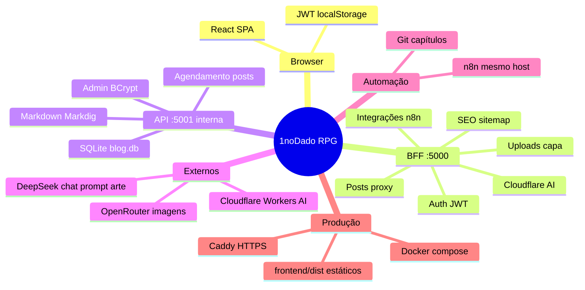

# Funcionalidades do sistema

Documentação das capacidades do **1noDado RPG**, contratos das APIs expostas pelo BFF e visão da arquitectura.

**Versão:** 2.6.7 · **Última actualização:** junho 2026

---

## Arquitectura — mapa de conexões



## Fluxo de funcionamento

```mermaid
flowchart TB
    subgraph Publico["Leitura pública"]
        U[Utilizador] --> FE[Frontend React]
        FE -->|GET posts, slug, indice| BFF
    end

    subgraph Autor["Área do autor"]
        A[Autor] --> FE
        FE -->|POST login| BFF
        BFF -->|JWT| FE
        FE -->|Bearer JWT| BFF
    end

    subgraph BFF["BFF :5000"]
        BFF[Blog Bff]
    end

    subgraph API["API interna :5001"]
        API[Blog Api]
        DB[(SQLite)]
        JOB[Publicação agendada]
    end

    BFF -->|X-Api-Key + X-Author-Id| API
    API --> DB
    JOB --> DB

    subgraph Integracao["Automação n8n"]
        N8N[n8n] -->|X-Integration-Key| BFF
        N8N --> OR[OpenRouter]
        BFF --> OR
    end

    subgraph PostForm["Formulário de post"]
        BFF --> DS[DeepSeek prompt]
        BFF --> OR2[OpenRouter capa]
    end

    subgraph ImagensUI["Geração UI"]
        BFF --> CF[Cloudflare Workers AI]
    end

    BFF -->|ficheiros| IMG[/images/posts/]
    Caddy[Caddy] --> FE
    Caddy --> BFF
    Caddy --> IMG
```

### Resumo do fluxo

1. O **browser** só fala com o **BFF** (`/bff/*`, `/sitemap.xml`, `/robots.txt`).
2. O **BFF** valida JWT (utilizadores) ou chave de integração (n8n) e reencaminha pedidos à **API** com `X-Api-Key` e `X-Author-Id`.
3. A **API** persiste em **SQLite**, converte Markdown em HTML na leitura pública e executa um job de **publicação agendada**.
4. Em **produção**, o **Caddy** serve o build estático do frontend, faz proxy do BFF e expõe imagens de capa em `/images/posts/`.

---

## Funcionalidades por área

### Leitura pública

| Funcionalidade | Rota / notas |
|----------------|--------------|
| Página inicial | `/` — destaque «Novo» + artigos recentes (só publicados) |
| Lista de posts | `/posts` — paginação, pesquisa, filtro por data |
| Artigo | `/post/:slug` — HTML; `view_count` só com JWT |
| Índice narrativo | `/indice` — `story_order`, universos Velho Mundo / Idade das Trevas |
| Tema claro/escuro | Persistido em `localStorage` |
| SEO | `/sitemap.xml`, `/robots.txt` (BFF) |

### Autenticação e contas

| Funcionalidade | Notas |
|----------------|-------|
| Login | E-mail + senha → JWT |
| Troca obrigatória de senha | Primeiro acesso com senha padrão |
| Contas | Perfil (nome, bio, senha); Admin gere todas as contas |
| Recuperação Admin | Ficheiro trigger no servidor + reinício da API |

### Área do autor

| Funcionalidade | Notas |
|----------------|-------|
| Dashboard | Total, publicados, planejados, rascunhos, visualizações, autores |
| Publicações | Lista com filtros, pesquisa, ordenação, criar/editar/excluir |
| Editor de posts | Markdown, capa, slug, agendamento, `story_type`, colaboradores |
| Prompt e capa no editor | **Gerar prompt para arte** (DeepSeek, `#post-art-prompt`, não persistido; prompts em inglês com tags **`Grimdark fantasy`** e **`Photographic`**) e **Gerar capa** (OpenRouter → upload); layout em duas colunas no desktop |
| Upload de capa | JPEG/PNG/WebP, máx. 5 MB |
| Geração de imagem (UI) | Cloudflare Workers AI; credenciais por autor em Contas |
| Ordem narrativa | Edição no índice (autenticados) |

### Integração n8n (automação)

| Funcionalidade | Notas |
|----------------|-------|
| Criar/agendar posts | Sem JWT; `X-Integration-Key`; autor = Admin |
| Atualizar por slug | Idempotência para reprocessamento Git |
| Gerar capa | OpenRouter (`INTEGRATIONS__OPENROUTER__APIKEY`) |

Ver [integrations/N8N-POST-INGEST.md](integrations/N8N-POST-INGEST.md).

---

## Contratos da API (BFF)

Base URL em desenvolvimento: `http://localhost:5000`. Em produção: mesmo origin do site (`/bff/...`).

Convenções:

- JSON com campos **snake_case** (ex.: `story_type`, `cover_image`).
- Datas em ISO 8601 UTC quando aplicável.
- A **API interna** (`/api/*`) não é pública; contratos abaixo são os do **BFF**.

### Autenticação

| Tipo | Header | Uso |
|------|--------|-----|
| Utilizador | `Authorization: Bearer <jwt>` | Área do autor, edição |
| Integração | `X-Integration-Key: <chave>` | `/bff/integrations/*` apenas |

---

### `POST /bff/auth/login`

**Auth:** nenhuma

**Body:**

```json
{ "email": "string", "password": "string" }
```

**Resposta 200:**

```json
{
  "token": "string",
  "author_id": "uuid",
  "author_name": "string",
  "is_admin": true
}
```

---

### Posts públicos

#### `GET /bff/posts`

**Query:** `order=date|story`, `page`, `pageSize`, `search`, `fromDate`, `toDate` (YYYY-MM-DD)

**Resposta:** lista paginada ou array de posts publicados (HTML em `content`).

#### `GET /bff/posts/{slug}`

**Resposta:** post publicado. `view_count` omitido sem JWT.

---

### Posts autenticados

#### `GET /bff/posts/editable` · `GET /bff/posts/author-area` · `GET /bff/posts/edit/{id}`

**Auth:** JWT

**Resposta:** posts com `content` em **Markdown** para edição.

#### `GET /bff/posts/next-story-order`

**Auth:** JWT

**Resposta:**

```json
{ "next_story_order": 42 }
```

#### `POST /bff/posts` · `PUT /bff/posts/{id}`

**Auth:** JWT

**Body (criar/atualizar):**

```json
{
  "title": "string",
  "slug": "apenas-minusculas-e-hifens",
  "content": "markdown",
  "story_type": "velho_mundo | idade_das_trevas",
  "excerpt": "string?",
  "cover_image": "/images/posts/....jpg?",
  "published": false,
  "story_order": 1,
  "include_in_story_order": true,
  "scheduled_publish_at": "2026-07-01T18:00:00Z?"
}
```

| Campo | Obrigatório | Regras |
|-------|-------------|--------|
| `title` | Sim | |
| `slug` | Sim | `^[a-z0-9]+(?:-[a-z0-9]+)*$` |
| `content` | Sim | Markdown |
| `story_type` | Sim | `velho_mundo` ou `idade_das_trevas` |
| `scheduled_publish_at` | Não | Futuro → rascunho até o job publicar |

**Respostas:** `201` create, `200` update, `409` slug duplicado, `403` sem permissão.

#### `DELETE /bff/posts/{id}`

**Auth:** JWT (dono ou Admin)

#### `PUT /bff/posts/story-order`

**Auth:** JWT

**Body:** `[{ "id": "uuid", "story_order": 1 }, ...]`

#### Colaboradores

- `POST /bff/posts/{id}/collaborators` — body `{ "author_id": "uuid" }`
- `DELETE /bff/posts/{id}/collaborators/{authorId}`

---

### Utilizadores

| Método | Rota | Auth | Descrição |
|--------|------|------|-----------|
| `GET` | `/bff/users` | JWT Admin | Listar contas |
| `GET` | `/bff/users/me` | JWT | Perfil actual |
| `POST` | `/bff/users` | JWT Admin | Criar conta |
| `PUT` | `/bff/users/{id}` | JWT | Actualizar perfil |
| `POST` | `/bff/users/{id}/reset-password` | JWT Admin | Reset senha padrão |
| `DELETE` | `/bff/users/{id}` | JWT Admin | Excluir |

---

### Autores

#### `GET /bff/authors`

**Auth:** JWT — lista para convite de colaboradores.

---

### Dashboard

#### `GET /bff/dashboard/stats`

**Auth:** JWT

**Resposta:** totais de posts, publicados, planejados, rascunhos, visualizações, autores.

---

### Upload de capa

#### `POST /bff/uploads/cover`

**Auth:** JWT · **Content-Type:** `multipart/form-data` · campo `file`

**Resposta 200:**

```json
{ "url": "/images/posts/{guid}.jpg" }
```

Regras: JPEG, PNG ou WebP; máx. 5 MB; validação por magic bytes.

---

### Geração de imagem (UI — Cloudflare)

#### `POST /bff/image-generation/generate`

**Auth:** JWT

**Body:**

```json
{ "prompt": "string" }
```

**Resposta:**

```json
{ "image": "<base64>" }
```

Credenciais Cloudflare do autor em Contas. Imagem **não** é persistida no servidor.

#### `POST /bff/image-generation/generate-openrouter`

**Auth:** JWT

**Body:**

```json
{ "prompt": "string" }
```

**Resposta:**

```json
{ "image": "<base64>" }
```

Geração via **OpenRouter** (`INTEGRATIONS__OPENROUTER__APIKEY` no BFF — mesma config que a integração n8n). Usado pelo formulário **Novo/Editar post** («Gerar capa»). O BFF acrescenta **`Grimdark fantasy`** e **`Photographic`** ao prompt quando em falta, antes de chamar o provider. Imagem **não** é persistida no servidor; o frontend faz upload via `POST /bff/uploads/cover`.

Erros: **503** se OpenRouter não estiver configurado (`openrouter_not_configured`). **400** com `content_moderated` quando o provider (ex. Black Forest Labs / Flux) bloqueia o prompt por moderação — mensagem: *O prompt foi bloqueado pelo filtro de conteúdo do gerador de imagens. Edite o prompt e tente novamente.*

#### `POST /bff/image-generation/generate-cover-art-prompt`

**Auth:** JWT

**Body:**

```json
{ "content": "<markdown do #post-content>" }
```

**Resposta:**

```json
{ "prompt": "Atmospheric tavern scene, Grimdark fantasy, Photographic" }
```

Geração via **DeepSeek API directa** (`DEEPSEEK__APIKEY` no BFF). O BFF envia mensagem **system** com regras de moderação para geradores de imagem e **user** com o Markdown da cena. O prompt devolvido é **normalizado** com **`Grimdark fantasy`** e **`Photographic`** (um parágrafo em inglês). Usado pelo formulário **Novo/Editar post** («Gerar prompt para arte»). O prompt preenche `#post-art-prompt` e **não** é persistido.

Erros: **503** se DeepSeek não estiver configurado (`deepseek_not_configured`).

#### `POST /bff/image-generation/verify`

**Auth:** JWT — testa credenciais guardadas.

---

### API de integração (n8n)

Endpoints para automações no mesmo servidor (ex.: **n8n**). **Não** usam JWT.

**Headers obrigatórios em todos os pedidos:**

```http
X-Integration-Key: <INTEGRATIONS__APIKEY>
```

**Configuração no BFF** (`bff.env`):

| Variável | Descrição |
|----------|-----------|
| `INTEGRATIONS__APIKEY` | Chave validada no header acima |
| `INTEGRATIONS__ADMINAUTHORID` | GUID do autor Admin (todos os posts criados/actualizados) |
| `INTEGRATIONS__OPENROUTER__APIKEY` | Chave OpenRouter (só geração de imagem) |
| `INTEGRATIONS__OPENROUTER__IMAGEMODEL` | Modelo por defeito: `black-forest-labs/flux.2-klein-4b` |

**Regras gerais:**

- O campo `author_id` no payload é **sempre ignorado**; `author_id` na resposta é o Admin configurado.
- Rate limit: política `Integrations` (30 pedidos/min por IP).
- Tamanho máximo do multipart (post + capa): **5 MB**.

**Erros comuns:**

| Código | Situação | Corpo típico |
|--------|----------|--------------|
| `401` | Chave ausente ou inválida | `{ "error": "Invalid integration key." }` |
| `503` | Chave de integração não configurada (produção) ou Admin/OpenRouter indisponível | `{ "error": "..." }` |
| `429` | Rate limit excedido | (sem corpo padronizado) |

Guia operacional: [integrations/N8N-POST-INGEST.md](integrations/N8N-POST-INGEST.md).

---

#### `POST /bff/integrations/posts`

Cria um post como **Administrador**.

**Auth:** `X-Integration-Key`

**Content-Type:** `multipart/form-data`

**Partes do formulário** (campos planos **ou** um único campo `metadata` com JSON; campos planos sobrescrevem valores dentro de `metadata`):

| Campo | Obrigatório | Tipo | Descrição |
|-------|-------------|------|-----------|
| `title` | Sim | string | Título do post |
| `content` | Sim | string | Corpo em **Markdown** |
| `story_type` | Sim | string | `velho_mundo` ou `idade_das_trevas` |
| `slug` | Não | string | Se omitido, derivado do `title` (slugify) |
| `excerpt` | Não | string | Resumo |
| `scheduled_publish_at` | Não | string | ISO 8601 UTC; se futuro → rascunho agendado |
| `published` | Não | bool | `true` para publicar já (default `false` se há agendamento) |
| `story_order` | Não | int | Se omitido, usa próximo valor sugerido |
| `include_in_story_order` | Não | bool | Default `true` |
| `cover_image` | Não | string | URL existente (ex.: `/images/posts/...`); ignorado se enviar ficheiro `cover` |
| `cover` | Não | file | JPEG, PNG ou WebP; máx. 5 MB |
| `metadata` | Não | string | JSON com os campos acima (snake_case) |
| `author_id` | — | string | **Ignorado** |

**Exemplo `metadata` (JSON no campo `metadata`):**

```json
{
  "title": "Capítulo 12",
  "content": "# Texto em Markdown",
  "story_type": "velho_mundo",
  "scheduled_publish_at": "2026-07-01T18:00:00Z",
  "slug": "capitulo-12",
  "excerpt": "Resumo opcional",
  "include_in_story_order": true
}
```

**Resposta 201** — mesmo formato do `POST /bff/posts` (post em Markdown, `author_id` do Admin):

```json
{
  "id": "uuid",
  "title": "Capítulo 12",
  "slug": "capitulo-12",
  "content": "# Texto em Markdown",
  "story_type": "velho_mundo",
  "excerpt": null,
  "cover_image": "/images/posts/abc123.jpg",
  "published": false,
  "published_at": null,
  "scheduled_publish_at": "2026-07-01T18:00:00Z",
  "story_order": 42,
  "include_in_story_order": true,
  "author_id": "49c95364-a432-4ead-8aaa-f630f8e70a31",
  "author": { "name": "...", "avatar": null, "bio": null }
}
```

**Outras respostas:**

| Código | Motivo |
|--------|--------|
| `400` | Campo obrigatório em falta, slug inválido, capa inválida | `{ "error": "..." }` |
| `401` | Chave de integração inválida |
| `409` | Slug já em uso | `{ "error": "Slug já em uso." }` |
| `503` | Admin não resolvido | `{ "error": "..." }` |

---

#### `PUT /bff/integrations/posts/{slug}`

Actualiza um post existente identificado pelo **slug** na URL.

**Auth:** `X-Integration-Key`

**Content-Type:** `multipart/form-data` (mesmos campos que `POST`)

**Path:** `{slug}` — slug actual do post (ex.: `capitulo-12`)

| Campo extra | Descrição |
|-------------|-----------|
| `allow_unpublish` | `true` para permitir `published=false` em post já publicado; sem isto, posts publicados mantêm-se publicados |

Se `slug` no formulário for omitido, usa o da URL. Ficheiro `cover` substitui a capa; `cover_image` só aplica se não houver ficheiro.

**Resposta 200** — objecto post (mesmo schema do create).

**Outras respostas:**

| Código | Motivo |
|--------|--------|
| `400` | Validação falhou |
| `404` | Slug não encontrado | `{ "error": "Post não encontrado. Use POST para criar." }` |
| `409` | Novo slug conflita com outro post |

---

#### `GET /bff/integrations/posts/next-story-order`

Devolve o próximo `story_order` sugerido (mesma regra que a Área do Autor), usando o autor Admin.

**Auth:** `X-Integration-Key`

**Resposta 200:**

```json
{ "next_story_order": 42 }
```

**Outras respostas:** `401`, `503` (Admin não resolvido).

---

#### `POST /bff/integrations/image-generation/generate`

Gera imagem de capa via **OpenRouter** (`POST https://openrouter.ai/api/v1/images`). Independente da geração Cloudflare da UI.

**Auth:** `X-Integration-Key`

**Content-Type:** `application/json`

**Query:** `upload` (opcional) — `true` grava a imagem em `/images/posts/` e devolve `cover_url`

**Body:**

```json
{
  "prompt": "Fantasy RPG scene, dramatic lighting",
  "model": "black-forest-labs/flux.2-klein-4b"
}
```

| Campo | Obrigatório | Descrição |
|-------|-------------|-----------|
| `prompt` | Sim | Texto para geração |
| `model` | Não | Sobrescreve `INTEGRATIONS__OPENROUTER__IMAGEMODEL` |

**Resposta 200** (sem `upload`):

```json
{ "image": "<base64 sem prefixo data:...>" }
```

**Resposta 200** (`?upload=true`):

```json
{
  "image": "<base64>",
  "cover_url": "/images/posts/abc123.png"
}
```

**Outras respostas:**

| Código | Motivo |
|--------|--------|
| `400` | `prompt` vazio ou imagem inválida ao gravar |
| `401` | Chave de integração inválida |
| `502` / `422` | Erro OpenRouter (mensagem genérica) |
| `503` | `INTEGRATIONS__OPENROUTER__APIKEY` não configurada | `{ "error": "OpenRouter não está configurado." }` |

**Fluxo típico n8n:** `POST .../generate` → decode base64 → `PUT .../posts/{slug}` com ficheiro `cover`, ou um único `POST .../posts` com capa já preparada.

---

### SEO

| Rota | Descrição |
|------|-----------|
| `GET /sitemap.xml` | URLs do site e posts publicados |
| `GET /robots.txt` | Inclui linha `Sitemap` |

---

## Modelo de dados (post)

| Campo JSON | Tipo | Descrição |
|------------|------|-----------|
| `id` | uuid | Identificador |
| `title` | string | Título |
| `slug` | string | URL amigável |
| `content` | string | Markdown (edição) ou HTML (público) |
| `excerpt` | string? | Resumo |
| `cover_image` | string? | Caminho `/images/posts/...` |
| `published` | bool | Visível na leitura pública |
| `published_at` | string? | ISO 8601 |
| `scheduled_publish_at` | string? | ISO 8601 UTC |
| `story_order` | int | Ordem narrativa |
| `story_type` | string | `velho_mundo` \| `idade_das_trevas` |
| `include_in_story_order` | bool | Aparece no índice |
| `author_id` | uuid? | Dono do post |
| `view_count` | int? | Só em respostas autenticadas |
| `author` | object | `name`, `avatar`, `bio` |

---

## Permissões

| Papel | Editar post | Excluir post |
|-------|-------------|--------------|
| Admin | Qualquer | Qualquer |
| Dono | Próprios | Próprios |
| Colaborador | Onde convidado | Não |

---

## Documentação relacionada

| Guia | Conteúdo |
|------|----------|
| [README](../README.md) | Visão geral e desenvolvimento local |
| [CHANGELOG](../CHANGELOG.md) | Versionamento |
| [Deploy Docker + Caddy](deploy/DEPLOY-DOCKER-CADDY.md) | Produção |
| [Atualizar 2.6.3 → 2.6.6](deploy/ATUALIZAR-2-6-3-PARA-2-6-6.md) | Upgrade desde a última versão em PROD |
| [Checklist produção](security/PRODUCTION-CHECKLIST.md) | Variáveis obrigatórias |
| [N8N](integrations/N8N-POST-INGEST.md) | Automação de capítulos |
| [OpenSpec](../openspec/project.md) | Especificações formais do projeto |
