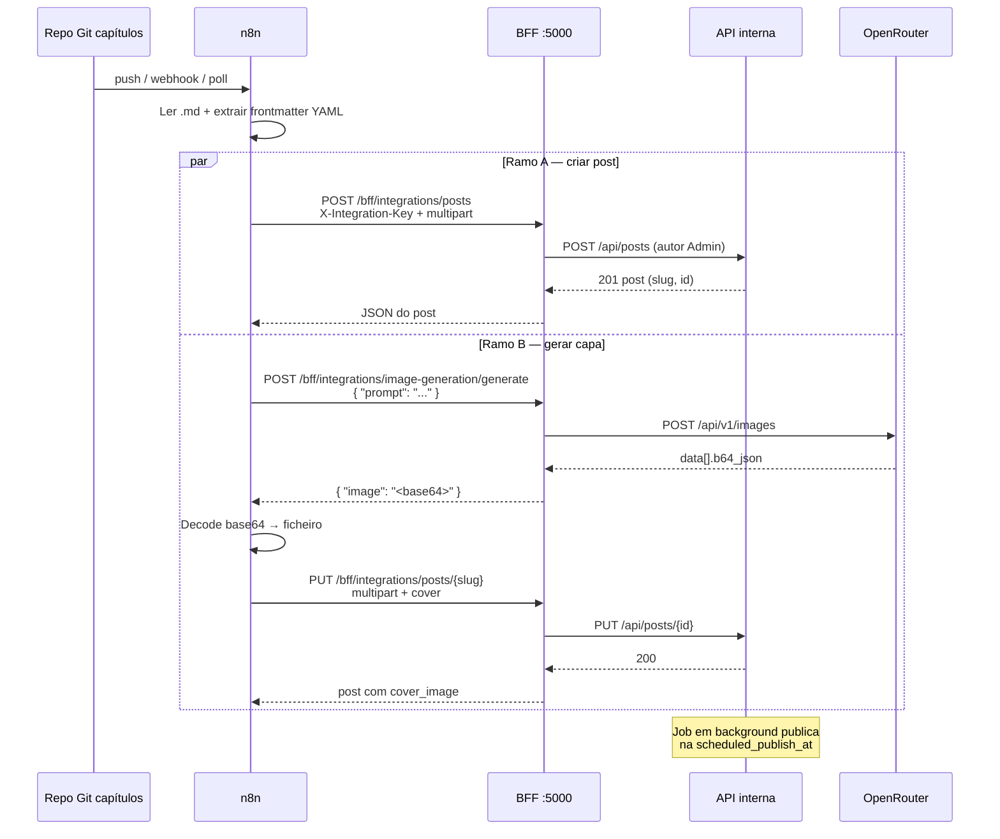

# Ingestão de posts via n8n (API de integração)

Guia para automatizar a criação e o agendamento de capítulos a partir de um repositório Git, usando **n8n** no mesmo servidor que o blog.

## Pré-requisitos

1. Blog em execução (BFF em `http://127.0.0.1:5000` no host).
2. Variáveis em **`bff.env`** (não commitar):

```bash
INTEGRATIONS__APIKEY=chave-forte-gerada-por-voce
INTEGRATIONS__ADMINAUTHORID=49C95364-A432-4EAD-8AAA-F630F8E70A31
INTEGRATIONS__OPENROUTER__APIKEY=sua-chave-openrouter
INTEGRATIONS__OPENROUTER__IMAGEMODEL=black-forest-labs/flux.2-klein-4b
```

| Variável | Obrigatório | Descrição |
|----------|-------------|-----------|
| `INTEGRATIONS__APIKEY` | Sim | Header `X-Integration-Key` em todos os pedidos da integração |
| `INTEGRATIONS__ADMINAUTHORID` | Recomendado | GUID do autor Admin; todos os posts ficam com este `AuthorId` |
| `INTEGRATIONS__OPENROUTER__APIKEY` | Para gerar capa | Chave OpenRouter (`/api/v1/images`) |
| `INTEGRATIONS__OPENROUTER__IMAGEMODEL` | Não | Modelo por defeito: `black-forest-labs/flux.2-klein-4b` |

**Segurança:** chame o BFF em **localhost** (`http://127.0.0.1:5000`). Não exponha `INTEGRATIONS__APIKEY` nem a chave OpenRouter ao browser.

## Autenticação

Todos os endpoints abaixo exigem:

```http
X-Integration-Key: <INTEGRATIONS__APIKEY>
```

Sem chave válida → **401 Unauthorized**.

## Campos mínimos

| Cenário | Campos |
|---------|--------|
| Capítulo agendado | `title`, `content`, `story_type`, `scheduled_publish_at` (ISO 8601 UTC) |
| Publicar já | `title`, `content`, `story_type`, `published=true` |
| Com capa no mesmo pedido | + ficheiro `cover` (JPEG/PNG/WebP, máx. 5 MB) |

- `story_type`: `velho_mundo` ou `idade_das_trevas`
- `slug`: opcional (derivado do `title` se omitido)
- `author_id` no payload é **ignorado** — o autor é sempre o Admin configurado

## Endpoints

| Método | Rota | Descrição |
|--------|------|-----------|
| `POST` | `/bff/integrations/posts` | Criar post (multipart) |
| `PUT` | `/bff/integrations/posts/{slug}` | Atualizar post existente |
| `GET` | `/bff/integrations/posts/next-story-order` | Próximo `story_order` sugerido |
| `POST` | `/bff/integrations/image-generation/generate` | Gerar capa via OpenRouter |

## Exemplos curl

### Criar post agendado (campos planos + capa)

```bash
curl -sS -X POST "http://127.0.0.1:5000/bff/integrations/posts" \
  -H "X-Integration-Key: SUA_CHAVE" \
  -F "title=Capítulo 12" \
  -F "content=# Texto em Markdown" \
  -F "story_type=velho_mundo" \
  -F "scheduled_publish_at=2026-07-01T18:00:00Z" \
  -F "cover=@/caminho/capa.jpg"
```

### Criar com metadata JSON

```bash
curl -sS -X POST "http://127.0.0.1:5000/bff/integrations/posts" \
  -H "X-Integration-Key: SUA_CHAVE" \
  -F 'metadata={"title":"Capítulo 12","content":"...","story_type":"velho_mundo","scheduled_publish_at":"2026-07-01T18:00:00Z"}'
```

### Gerar imagem de capa (OpenRouter)

```bash
curl -sS -X POST "http://127.0.0.1:5000/bff/integrations/image-generation/generate" \
  -H "X-Integration-Key: SUA_CHAVE" \
  -H "Content-Type: application/json" \
  -d '{"prompt":"Fantasy RPG scene, dramatic lighting"}'
```

Resposta: `{ "image": "<base64>" }`.

Com gravação automática da capa: acrescente `?upload=true` — resposta inclui `cover_url`.

### Atualizar capa depois de gerar

```bash
curl -sS -X PUT "http://127.0.0.1:5000/bff/integrations/posts/capitulo-12" \
  -H "X-Integration-Key: SUA_CHAVE" \
  -F "title=Capítulo 12" \
  -F "content=# Texto atualizado" \
  -F "story_type=velho_mundo" \
  -F "cover=@/caminho/capa-decodificada.png"
```

## Fluxo n8n recomendado

### Visão geral (sequência)

Quando o repositório Git recebe um novo capítulo, o n8n lê o Markdown e, em **paralelo**, cria o post agendado e gera a capa via OpenRouter.



### Workflow n8n (fluxograma)

Estrutura sugerida dos nós no editor n8n:

```mermaid
flowchart TB
    subgraph trigger["1. Trigger"]
        T[Git Webhook / Schedule Poll]
    end

    subgraph parse["2. Preparar dados"]
        R[Ler ficheiro .md do repo]
        P[Code: extrair frontmatter YAML<br/>title, slug, story_type,<br/>scheduled_publish_at, cover_prompt]
        M[Montar body Markdown<br/>sem frontmatter]
    end

    subgraph parallel["3. Execução paralela"]
        direction TB
        subgraph branchA["Ramo A — Post"]
            A1[HTTP Request<br/>POST /bff/integrations/posts]
            A2[Guardar slug + id da resposta]
        end
        subgraph branchB["Ramo B — Capa"]
            B1[HTTP Request<br/>POST .../image-generation/generate]
            B2[Convert to File<br/>base64 → PNG]
            B3[HTTP Request<br/>PUT .../posts/{slug}<br/>+ cover]
        end
    end

    subgraph alt["Alternativa: um único POST"]
        direction LR
        X1[Generate image]
        X2[Convert to File]
        X3[Merge metadata + cover]
        X4[POST /integrations/posts<br/>com cover no multipart]
    end

    T --> R --> P --> M
    M --> parallel
    A1 --> A2
    B1 --> B2 --> B3

    M -.->|ou merge antes| alt
```

### Passos resumidos

1. **Trigger:** webhook ou poll no repositório de capítulos (Git).
2. **Ler** ficheiro `.md` (opcional: frontmatter YAML com `title`, `story_type`, `scheduled_publish_at`, `slug`, `cover_prompt`).
3. **Em paralelo:**
   - **A:** `POST /bff/integrations/posts` com texto e agendamento → resposta com `slug` e `id`.
   - **B:** `POST .../image-generation/generate` com `cover_prompt` → converter base64 em ficheiro → `PUT .../posts/{slug}` com `cover`.
4. **Alternativa:** nó **Merge** no n8n → gerar imagem → converter para ficheiro → um único `POST` com `cover` + metadata (sem ramo B separado).

### Credenciais no n8n

| Nó HTTP Request | Header / config |
|-----------------|-----------------|
| Todos os pedidos à integração | `X-Integration-Key: {{ $env.INTEGRATIONS_APIKEY }}` |
| URL base | `http://127.0.0.1:5000` (mesmo host que o BFF) |

Não colocar a chave no repositório Git; usar variáveis de ambiente ou credenciais do n8n.

## Convenção Git (sugestão)

```markdown
---
title: O Encontro
story_type: velho_mundo
scheduled_publish_at: 2026-07-01T18:00:00Z
slug: o-encontro
cover_prompt: "Fantasy RPG scene, ..."
---

Texto do capítulo...
```

O n8n extrai o frontmatter (nó Code/YAML) e mapeia para a API.

## Notas

- A **Geração de Imagem** na Área do Autor continua a usar **Cloudflare**; a integração n8n usa **OpenRouter** no BFF.
- Reprocessar o mesmo ficheiro: use `PUT /bff/integrations/posts/{slug}` (evita 409 por slug duplicado).
- Posts já publicados não são despublicados automaticamente; envie `allow_unpublish=true` apenas se necessário.
