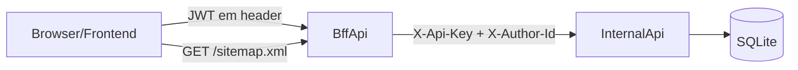

# Avaliação de segurança e plano de hardening — simple-blog-hub

Este documento descreve a **avaliação de segurança** do projeto (revisão estática do frontend, BFF, API e infraestrutura) e o **plano de melhorias** priorizado. As alterações de código **não** estão aplicadas; o documento serve como referência para implementação futura.

## Objetivo

Fortalecer a segurança do simple-blog-hub em camadas (frontend, BFF/API e infra) através de um plano priorizado com ações concretas e ficheiros relevantes, a implementar incrementalmente.

## Contexto e arquitetura relevante

- **Frontend**: React/Vite, autenticação via JWT armazenado em `sessionStorage`, consumo do BFF.
  - Código relevante: `frontend/src/auth/storage.ts`, `frontend/src/pages/PostPage.tsx`.
- **BFF**: ASP.NET Core, termina a autenticação do utilizador (login, JWT), expõe endpoints ao frontend, fala com a API interna.
  - Código relevante: `backend/bff/Program.cs`, `backend/bff/Controllers/UploadsController.cs`, `backend/bff/Services/JwtService.cs`, `backend/bff/appsettings.json`.
- **API**: ASP.NET Core, só exposta ao BFF, usa `X-Api-Key` e `X-Author-Id`.
  - Código relevante: `backend/api/Program.cs`, `backend/api/Controllers/AuthController.cs`, `backend/api/Controllers/UsersController.cs`, `backend/api/Controllers/PostsController.cs`, `backend/api/Services/MarkdownService.cs`, `backend/api/Services/PasswordValidation.cs`, `backend/api/appsettings.json`.
- **Infraestrutura**: Docker Compose, SQLite local, Caddy descrito em docs.
  - Código relevante: `docker-compose.yml`, `DEPLOY-DOCKER-CADDY.md`, Dockerfiles em `backend/api/` e `backend/bff/`.

### Fluxo simplificado

## Principais riscos identificados (resumo)

1. **XSS e HTML não sanitizado**: `PostPage` usa `dangerouslySetInnerHTML` e o `MarkdownService` aceita HTML bruto → risco crítico de XSS.
2. **Tokens JWT em sessionStorage**: sujeitos a roubo via XSS.
3. **CORS permissivo e headers de segurança ausentes**: em `backend/bff/Program.cs` e `backend/api/Program.cs`.
4. **Segredos fracos ou opcionais**: `Jwt:Secret` com fallback dev, `API:InternalKey` opcional, secrets e email de admin em `appsettings.json`.
5. **Uploads de imagens validados apenas por Content-Type**: em `UploadsController`.
6. **Ausência de rate limiting**: especialmente em login e uploads.
7. **Validação de input incompleta**: DTOs sem Data Annotations, política de senha fraca, e-mails sem validação forte.
8. **Logging/auditoria insuficientes**: poucas trilhas para ações administrativas; risco de logging de dados sensíveis.
9. **Hardening de infra incompleto**: Docker possivelmente como root, Caddyfile não versionado (headers e HTTPS dependem de documentação).

## Plano de melhorias (por prioridade)

### Fase 1 — Proteção contra XSS e roubo de sessão

- **Sanitização de HTML**
  - Introduzir uma camada de sanitização de HTML no backend (`MarkdownService`) antes de devolver conteúdo, ou no frontend antes de `dangerouslySetInnerHTML`.
  - Avaliar bibliotecas como DOMPurify (frontend) e um sanitizer .NET (backend) e decidir se a sanitização será single-source-of-truth no backend.
  - Garantir que o caso especial de HTML "pass-through" no `MarkdownService` (`StartsWith("<")`) seja tratado com sanitização forte.
- **Estratégia de armazenamento de tokens**
  - Avaliar migração de tokens de `sessionStorage` para **cookies HttpOnly + SameSite=Strict** emitidos pelo BFF, mantendo a API stateless.
  - Se permanecer em `sessionStorage`, endurecer XSS (sanitização + Content-Security-Policy agressiva) e rever todos os pontos com `dangerouslySetInnerHTML`.

### Fase 2 — CORS, headers de segurança e secrets

- **CORS restritivo**
  - Em `backend/bff/Program.cs`, tornar obrigatória a configuração de `Cors:AllowedOrigins` em produção; falhar o arranque se estiver vazia.
  - Definir política CORS por ambiente (origens explícitas no `.env`/appsettings).
- **Headers de segurança HTTP**
  - Introduzir um middleware de security headers na API e BFF (ou configurar em Caddy), incluindo pelo menos:
    - `X-Content-Type-Options: nosniff`
    - `X-Frame-Options: DENY`
    - `Referrer-Policy: no-referrer`
    - `Strict-Transport-Security` (em produção, com HTTPS)
    - `Content-Security-Policy` mínima que permita o frontend atual mas restrinja fontes externas.
- **Fortalecimento de secrets e chaves internas**
  - Validar em `Program.cs` (API e BFF) que:
    - `Jwt:Secret` tem tamanho e entropia mínimos em produção.
    - `API:InternalKey` está definido; caso contrário, recusar arranque.
  - Centralizar leitura de secrets via variáveis de ambiente/secret store e evitar valores reais em `appsettings.*.json`.

### Fase 3 — Uploads, validação de input e autenticação

- **Validação robusta de uploads de imagem**
  - Em `backend/bff/Controllers/UploadsController.cs`:
    - Validar magic bytes (assinatura do ficheiro) para formatos permitidos.
    - Opcional: verificar dimensões e tamanho máximo de imagem, rejeitando ficheiros suspeitos.
- **Validação de DTOs e modelo de domínio**
  - Adicionar Data Annotations (`[Required]`, `[EmailAddress]`, `[StringLength]`, etc.) nos DTOs em `backend/api/Models/*Dtos.cs`.
  - Padronizar validação de slug (regex restritiva) e campos textuais (limites de tamanho).
- **Política de senha e autenticação**
  - Endurecer política de senha em `PasswordValidation` (mínimo 8–12 caracteres, complexidade, prevenção de senhas comuns).
  - Considerar mecanismos de proteção contra brute-force no login (contagem de tentativas, bloqueio temporário).

### Fase 4 — Rate limiting, logging e auditoria

- **Rate limiting**
  - Introduzir rate limiting a nível de BFF (middleware ou biblioteca dedicada) com regras específicas para:
    - Login (limites mais baixos por IP/conta).
    - Uploads e endpoints administrativos.
- **Logging e auditoria**
  - Rever pontos de logging para garantir que senhas/tokens nunca são logados.
  - Implementar logs de auditoria para ações administrativas: criação/remoção de utilizadores, reset de senha, publicação/remoção de posts.

### Fase 5 — Hardening de infra e documentação

- **Docker e permissões**
  - Os Dockerfiles da API e BFF **podem** executar como **root** quando a operação com volumes montados (ex.: `data/` no host) assim o exigir, para evitar o erro "readonly database" da API; o trade-off (segurança vs. operacionalidade) está documentado no spec e neste documento.
  - Garantir que a pasta `data/` no host é gravável pelo processo (quando os contentores correm como root, tipicamente já o é).
- **Caddy e HTTPS**
  - Versionar um `Caddyfile` de exemplo alinhado com `DEPLOY-DOCKER-CADDY.md`, incluindo:
    - Redirecionamento HTTP → HTTPS.
    - Headers de segurança mencionados na Fase 2.
    - Regras de cache adequadas (não cachear respostas sensíveis).
- **Documentação de hardening**
  - Criar ou expandir documentação de hardening (p.ex. em `docs/`), listando:
    - Variáveis obrigatórias para produção.
    - Recomendações de firewall/segurança de host.
    - Checklist de revisão antes de subir uma nova versão.

## Sequência recomendada

1. **Começar pela Fase 1** (XSS e tokens) porque tem o maior impacto direto em confidencialidade da sessão.
2. Em paralelo, avançar parte da **Fase 2** (CORS + headers de segurança + secrets obrigatórios) pois é majoritariamente configuração.
3. Depois, **endereçar uploads e DTOs** (Fase 3) para reduzir risco de payloads maliciosos e inputs inválidos.
4. Adicionar **rate limiting e auditoria** (Fase 4) para resiliência e rastreabilidade.
5. Por fim, **hardening de Docker/Caddy e documentação** (Fase 5) para consolidar práticas de segurança na operação.

Este plano mantém as mudanças moduladas por área (frontend, BFF, API, infra) e permite implementar melhorias incrementalmente, priorizando os riscos mais críticos primeiro. Os requisitos formais estão em `openspec/specs/security-hardening/spec.md` (após arquivo da change `add-security-hardening-assessment`).

## Requisitos de logging e permissões no host

### Logging sem dados sensíveis

Os pontos de logging existentes e futuros **não** devem registar senhas, tokens JWT, chaves de API ou outros dados sensíveis em texto claro. Ao implementar ou rever logging (incluindo auditoria), verificar que nenhum `ILogger` ou middleware regista o corpo de pedidos de login, headers de autorização ou variáveis de ambiente com segredos. Recomenda-se uma revisão periódica dos ficheiros que usam `ILogger` (controllers, services) para garantir conformidade.

### Permissões da pasta de dados no host

Em deploy com a base SQLite no **host** (ex.: pasta `data/` exposta ao contentor da API via bind mount), a pasta **deve** ser gravável pelo processo da API. Na implementação atual os contentores correm como **root** por compatibilidade com volumes (evita "readonly database" e dependência de `chown` no host); a pasta no host deve existir e ser gravável (ex.: pelo utilizador que executa o Docker). Quando os contentores usarem utilizador não-root, a documentação deve indicar o passo de `chown` para o UID do contentor. O trade-off entre segurança (não-root) e operacionalidade (root) está documentado.
